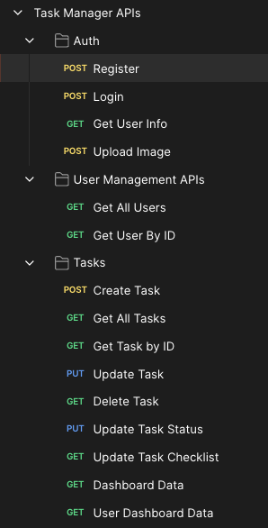
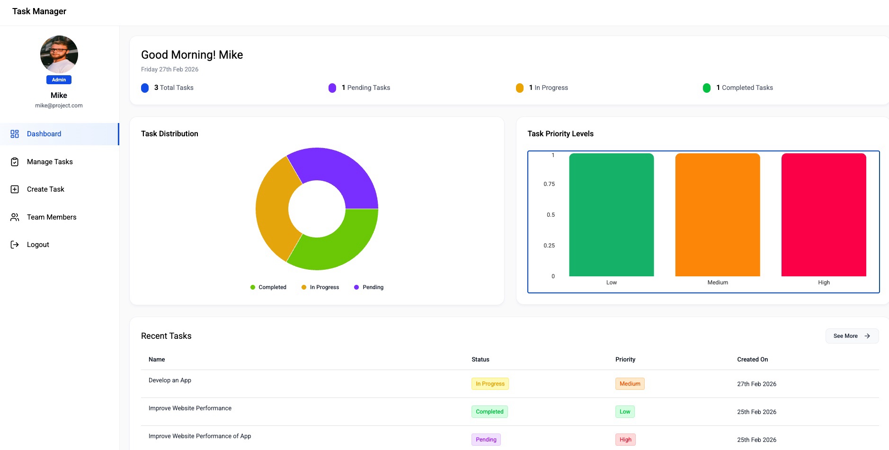
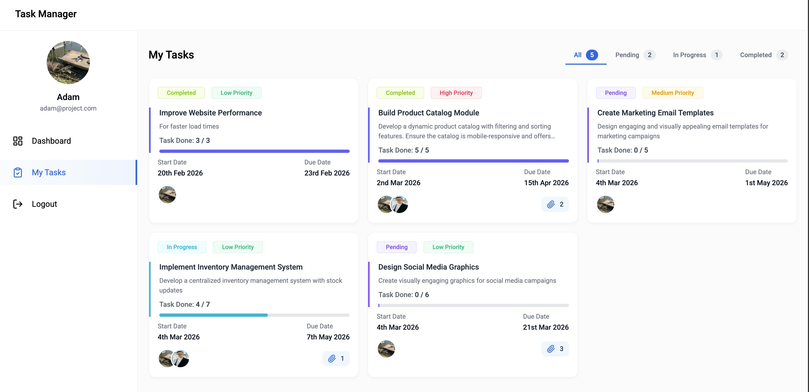
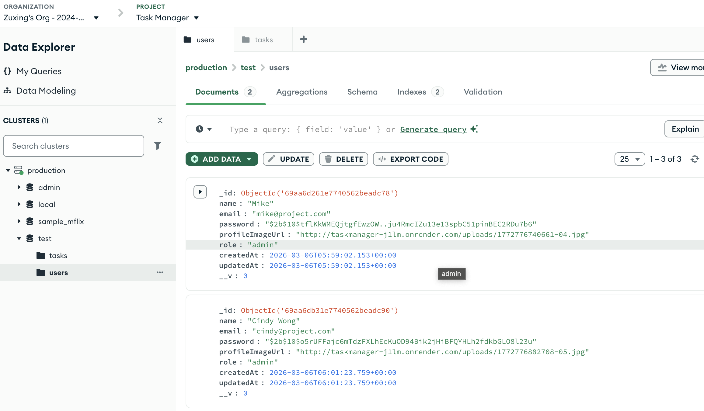

# Task Manager system using MERN
**This is a simple Task Manager system built using the MERN stack (MongoDB, Express, React, Node.js). It allows users to create, read, update, and delete tasks, as well as generate reports based on task data.**

**Live Demo**: https://task-manager-zuxing.vercel.app/signup

## Backend
The backend is built using Node.js and Express. It connects to a MongoDB database to store task data. The backend provides RESTful API endpoints for managing tasks and generating reports.

`JWT` is used for authentication, and `Multer` is used for handling file uploads. Express middleware is used for `CORS` and `JSON` parsing. Exporting excel files is handled using `ExcelJS`.
The backend web service is deployed on [Render](https://render.com/), which provides a platform for hosting web applications. The backend service is responsible for handling API requests from the frontend, performing database operations, and generating reports based on task data.

## Frontend
The frontend is built using React & Vite. It provides a user interface for managing tasks and viewing reports. The frontend communicates with the backend API to perform `CRUD` operations on tasks and to fetch report data. It uses `Axios` for making HTTP requests and `React Router` for navigation.
Admin users can log in to the system and manage tasks, while regular users can only view and update their own tasks. The UI is designed to be simple and user-friendly, allowing users to easily navigate through the application and perform necessary actions.

The frontend web application is deployed on [Vercel](https://vercel.com/), which provides a platform for hosting frontend applications. The frontend application interacts with the backend API to display task data and generate reports based on user interactions.

## Database
[MongoDB](https://www.mongodb.com/) is used as the database to store task data. `Mongoose` is used for object data modeling (ODM) to interact with the MongoDB database.
The database schema includes fields for task name, description, status, assigned user, and timestamps for creation and updates. The database is hosted on [MongoDB Atlas](https://www.mongodb.com/cloud/atlas), which provides a cloud-based solution for managing MongoDB databases.

## References:
YouTube video: [Build a Full-Stack MERN Task Manager | React, Node.js, MongoDB, Express | MERN Project
](https://www.youtube.com/watch?v=fZK57PxKC-0)

YouTube video: [Build and Deploy a Full Stack MERN Project - Task Manager Application](https://www.youtube.com/watch?v=3YmDEF2p8_Y)